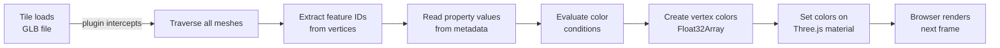

# Styling 3D Tiles in the browser with a custom plugin

## Introduction

3D Tiles is an open standard for streaming and rendering massive 3D geospatial datasets. A tileset might contain millions of buildings, terrain models, or point clouds. Each tile is a GLB (binary glTF) file that contains geometry and feature data.

The problem: how do you style all those features without modifying the source data or processing everything on the server? You could send pre-colored tiles, but that means creating separate tilesets for every color scheme. A better approach is to style the tiles on the client—in the browser—based on rules defined by the application.

This plugin brings the Cesium 3D Tiles Styling Specification to 3DTilesRendererJS. It lets you define color conditions based on feature properties (like building height or land-use type), and the browser applies those styles to the 3D geometry as tiles load. No server processing. No pre-rendered variations. One dataset, infinite styling possibilities.

## How 3D Tiles stores feature data

Modern 3D Tiles use two extensions to store feature properties within GLB files:

- **EXT_mesh_features**: Associates vertices and faces with feature IDs
- **EXT_structural_metadata**: Stores the actual property values in lookup tables

When you generate 3D Tiles from a database (for example, using pg2b3dm), the generator reads attributes from your data and embeds them as properties. A building might have `height`, `construction_year`, `building_type`, and `population_count` as properties.

The mesh vertices are tagged with a feature ID (via the `_FEATURE_ID_0` attribute). The plugin uses that ID to look up the feature's properties in the metadata tables. This design keeps file sizes small—properties are stored once per feature, not once per vertex.

## The Cesium 3D Tiles Styling Specification

Cesium developed a styling specification that works in their 3D Tiles implementation. It defines a simple expression language for coloring features based on property values.

The basic syntax is a list of conditions:

```javascript
{
  color: {
    conditions: [
      ["${height} <= 10", "color('#430719')"],
      ["${height} > 10 && ${height} <= 20", "color('#740320')"],
      ["${height} > 20", "color('#f72585')"],
      ["true", "color('#ffffff')"]
    ]
  }
}
```

The plugin evaluates each condition in order. The first one that returns `true` determines the color for that feature. This creates a simple, declarative way to map data to color without writing imperative JavaScript.

## How the plugin works

When you register the plugin with TilesRenderer, it hooks into the `load-model` event. Every time a new tile (GLB) is loaded, the plugin springs into action:



Step by step:

1. **Extract feature IDs**: The plugin reads the `_FEATURE_ID_0` vertex attribute. This array maps each vertex to a feature (e.g., vertex 100 belongs to feature 5).

2. **Read property values**: For each feature, the plugin looks up the property value in the structural metadata table. It retrieves the value of the property you're testing (e.g., `height` for feature 5).

3. **Evaluate conditions**: It evaluates the condition expressions in order: `${height} <= 10`, then `${height} > 10 && ${height} <= 20`, and so on. As soon as one evaluates to `true`, it uses that color.

4. **Apply vertex colors**: The plugin creates a Float32Array of RGBA values, one color per vertex. Vertices belonging to the same feature get the same color.

5. **Update material**: It sets the `color` attribute on the geometry and sets `vertexColors = true` on the material. Three.js handles the rest.

The entire process runs on the GPU-bound thread. Once styled, tiles are indistinguishable from pre-colored tiles—the rendering performance is identical.

## The sample: Sibbe, Limburg

The repository includes a sample that demonstrates the plugin in action. It shows BAG (Basisregistratie Adressen en Gebouwen) building data—a comprehensive database of all registered buildings in the Netherlands.

The sample focuses on Sibbe, a village in Limburg, and colors buildings by height:

- **Dark navy** (`#430719`): 0–10 meters
- **Medium rose** (`#740320`): 10–20 meters
- **Vivid rose** (`#f72585`): 20+ meters
- **White**: Properties without height data

When you open the sample, you see the village rendered as a 3D map. The color gradient immediately reveals patterns: residential areas with uniform rooflines, churches and civic buildings standing taller, and industrial zones mixed in.

This is the power of interactive styling. The same dataset can be colored by construction year (to show development over time), by energy class (to identify inefficient buildings), or by any other property in the data. Each perspective tells a different story.

The sample uses MapLibre GL to render the base map and 3DTilesRenderer to display the styled 3D buildings. The tiles were generated from the BAG database using pg2b3dm.

## What is supported

The plugin implements a subset of the Cesium styling specification. It focuses on what makes sense for client-side rendering.

| Feature | Supported | Notes |
|---------|-----------|-------|
| Color conditions | ✓ | Full expression evaluation |
| Property access | ✓ | `${propertyName}` and `${feature['propertyName']}` |
| Comparison operators | ✓ | `<`, `<=`, `>`, `>=`, `===`, `!==`, `==`, `!=` |
| Boolean operators | ✓ | `&&`, `\|\|` |
| Color functions | ✓ | `color()`, `rgb()`, `rgba()` with hex and decimal |
| Catch-all condition | ✓ | Use `"true"` as final condition |
| `show` property | ✗ | Not implemented |
| `defines` | ✗ | Not applicable to client rendering |
| Math functions | ✗ | `clamp()`, `min()`, `max()` not yet implemented |
| String comparisons | ✗ | Properties assumed numeric |
| Regular expressions | ✗ | Not implemented |
| Ternary operators | ✗ | Not supported in V1 |
| `pointSize` | ✗ | Not applicable to mesh rendering |

The subset was chosen to handle the most common use case: coloring polygons (buildings, parcels, regions) based on numeric or boolean properties.

## Getting started

Install the plugin:

```bash
npm install @bertt/3dtilesrenderer-styling-plugin
```

Register the required GLTF extensions:

```javascript
import { GLTFLoader } from 'three/examples/jsm/loaders/GLTFLoader.js';
import { GLTFMeshFeaturesExtension, GLTFStructuralMetadataExtension } from '3d-tiles-renderer';

const gltfLoader = new GLTFLoader();
gltfLoader.register(parser => new GLTFMeshFeaturesExtension(parser));
gltfLoader.register(parser => new GLTFStructuralMetadataExtension(parser));
```

Create a TilesRenderer, define your style, and register the plugin:

```javascript
import { TilesRenderer } from '3d-tiles-renderer';
import { CesiumStylingPlugin } from '@bertt/3dtilesrenderer-styling-plugin';

const tiles = new TilesRenderer('https://example.com/tileset.json');
tiles.setCamera(camera);
tiles.setResolutionFromRenderer(renderer);

const style = {
  color: {
    conditions: [
      ["${height} <= 10", "color('#430719')"],
      ["${height} > 10", "color('#f72585')"],
      ["true", "color('#ffffff')"]
    ]
  }
};

tiles.registerPlugin(new CesiumStylingPlugin({ style }));
scene.add(tiles.group);
```

That's it. As tiles load, the plugin applies your style. You can change the style at runtime by creating a new plugin instance with updated conditions.

## Conclusion

3D Tiles gives you massive geographic datasets in the browser. Styling gives those datasets meaning. Instead of static imagery, you get interactive 3D models that reveal patterns, support exploration, and respond to user queries.

The plugin eliminates the server-side processing bottleneck. You don't need to pre-render variations of your data or maintain separate tilesets for different color schemes. You define conditions—in code, in configuration, or driven by user input—and the browser handles the rest.

The Cesium styling specification provides a simple, expressive language for that definition. The plugin brings it to 3DTilesRenderer, enabling the same styling capabilities in open-source workflows that Cesium users have had for years.

The result: one dataset, styled a hundred different ways, all rendered client-side, all interactive, all instant.
