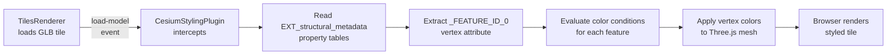

# 3dtilesrenderer-styling-plugin

A plugin for 3DTilesRendererJS that applies Cesium 3D Tiles Styling Specification color conditions to 3D tile features. It reads feature properties from GLB tiles via EXT_structural_metadata, evaluates color conditions based on property values, and applies per-feature vertex colors using Three.js materials.

Original styling specs see https://github.com/CesiumGS/3d-tiles/tree/main/specification/Styling

## Architecture

The plugin implements the TilesRenderer plugin pattern and intercepts the `load-model` event to style GLB tiles as they are loaded.



The plugin processes each tile independently. For every mesh in the loaded GLB:
1. It retrieves the feature ID for each vertex via the `_FEATURE_ID_0` attribute
2. It looks up the feature's property values in the structural metadata tables
3. It evaluates the color conditions against the property value
4. It creates per-vertex colors in a Float32Array
5. It sets the vertex color attribute and enables `vertexColors` on the material

## Demo

Color buildings by height

https://bertt.github.io/3dtilesrenderer-styling-plugin/sample/sibbe/


## Installation

```bash
npm install @bertt/3dtilesrenderer-styling-plugin
```

https://www.npmjs.com/package/@bertt/3dtilesrenderer-styling-plugin

Requires Three.js and 3d-tiles-renderer as peer dependencies.

## Usage

### Prerequisites

Before using the plugin, register the required GLTF extensions on your GLTFLoader:

```javascript
import { GLTFLoader } from 'three/examples/jsm/loaders/GLTFLoader.js';
import { GLTFMeshFeaturesExtension } from '3d-tiles-renderer';
import { GLTFStructuralMetadataExtension } from '3d-tiles-renderer';

const gltfLoader = new GLTFLoader();
gltfLoader.register(parser => new GLTFMeshFeaturesExtension(parser));
gltfLoader.register(parser => new GLTFStructuralMetadataExtension(parser));
```

### Basic example

```javascript
import { TilesRenderer } from '3d-tiles-renderer';
import { CesiumStylingPlugin } from '@bertt/3dtilesrenderer-styling-plugin';

// Create the tiles renderer
const tiles = new TilesRenderer('https://example.com/tileset.json');
tiles.setCamera(camera);
tiles.setResolutionFromRenderer(renderer);

// Define the style
const style = {
  color: {
    conditions: [
      ["${height} <= 10", "color('#430719')"],
      ["${height} > 10 && ${height} <= 20", "color('#740320')"],
      ["${height} > 20", "color('#f72585')"],
      ["true", "color('#ffffff')"]
    ]
  }
};

// Create and register the plugin
const plugin = new CesiumStylingPlugin({ style });
tiles.registerPlugin(plugin);

// Add to scene and render
scene.add(tiles.group);
```

### How color conditions work

The plugin evaluates conditions in order. The first condition that evaluates to `true` determines the color for that feature.

Each condition is an array: `[expression, colorFunction]`

- **Expression**: A string that evaluates to boolean, using property names from the tileset's structural metadata
- **Color function**: A string like `"color('#RRGGBB')"` that specifies the output color

## Style Syntax

### Supported features

| Feature | Example | Status |
|---------|---------|--------|
| Property access (bracket) | `${feature['height']}` | ✓ Supported |
| Property access (shorthand) | `${height}` | ✓ Supported |
| Comparison operators | `<=`, `>=`, `<`, `>`, `===`, `!==`, `==`, `!=` | ✓ Supported |
| Boolean operators | `&&`, `\|\|` | ✓ Supported |
| Catch-all condition | `"true"` | ✓ Supported |
| RGB color | `color('#RRGGBB')` | ✓ Supported |
| RGBA color | `color('#RRGGBB', alpha)` | ✓ Supported |
| CSS rgb() | `rgb(255, 0, 128)` | ✓ Supported |
| CSS rgba() | `rgba(255, 0, 128, 0.5)` | ✓ Supported |

### Not supported in V1

| Feature | Reason |
|---------|--------|
| `show` property | Requires feature-level visibility control |
| `defines` property | Not applicable to client-side rendering |
| Mathematical functions | `clamp()`, `min()`, `max()` not yet implemented |
| Regular expressions | Pattern matching not implemented |
| `meta` property | Metadata about the style not supported |
| String comparisons | Property values assumed to be numeric |
| Ternary expressions | Syntax not parsed |
| `pointSize` property | Not applicable to polygon/mesh rendering |

### Color expression examples

```javascript
// Hex colors
"color('#FF0000')"           // Solid red
"color('#00FF00', 0.5)"      // Half-transparent green

// RGB/RGBA functions
"rgb(255, 165, 0)"           // Orange
"rgba(0, 0, 255, 0.8)"       // Semi-transparent blue

// Conditional examples
"${height} > 100"            // Compare height property
"${type} === 'residential' && ${height} > 15"
"${population} >= 10000 || ${area} > 5000"
```

## Options

### Constructor options

```javascript
new CesiumStylingPlugin(options)
```

| Option | Type | Required | Description |
|--------|------|----------|-------------|
| `style` | object | yes | Style object with `color.conditions` array |

The `style` object shape:

```javascript
{
  color: {
    conditions: [
      [expression, colorFunction],
      [expression, colorFunction],
      // ...
      ["true", fallbackColor]  // Recommended catch-all
    ]
  }
}
```

## Sample

A working sample is included in `sample/sibbe/index.html`. It demonstrates styling of BAG (Basisregistratie Adressen en Gebouwen) building data in Sibbe, Limburg, colored by building height.

The sample uses a color gradient:
- Dark navy (`#430719`) for buildings 0–10 meters
- Rose (`#f72585`) for buildings above 30 meters

### Running the sample locally

1. Open a terminal in the repository root
2. Start a local HTTP server:
   ```bash
   npx http-server
   ```
3. Open `http://localhost:8080/sample/sibbe/` in your browser

Or open `sample/sibbe/index.html` directly in your browser if using a modern browser with CORS enabled for file:// URLs (some browsers restrict this).

## Publishing

To publish a new version to npm:

```bash
npm login
npm publish --access public
```

Notes:
- The package is configured as a public scoped package (`@bertt/`), so `--access public` is required
- Ensure you have permissions for the `@bertt` scope
- No build step is required; the source files are published as-is (ES modules)
- Update the version number in `package.json` before publishing

## License

MIT
